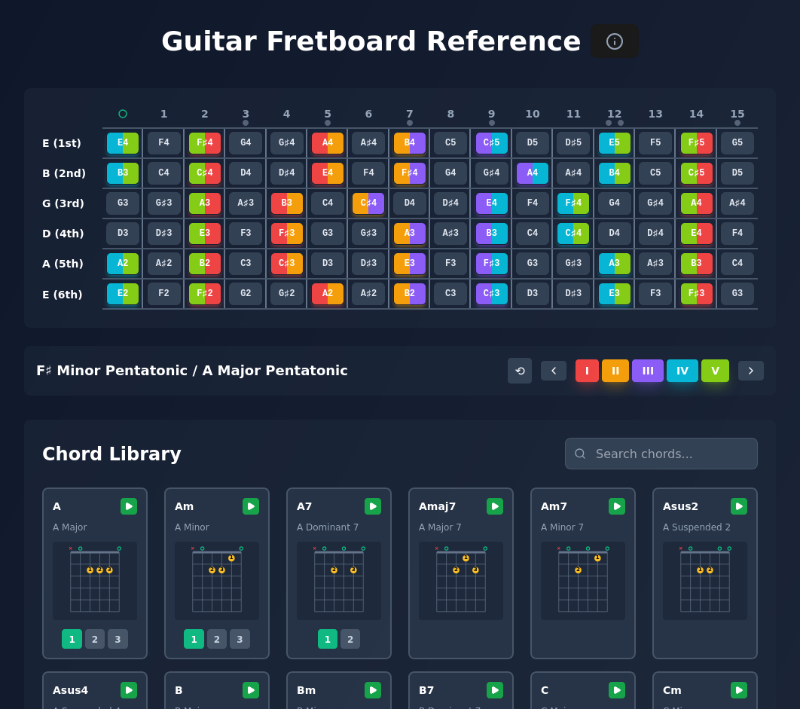

# Guitar Fretboard Reference

An interactive web-based guitar learning tool for visualizing chord fingerings and pentatonic scale patterns across the fretboard.



## Features

- **Interactive Fretboard**: 6-string, 15-fret visualization with standard tuning (E-A-D-G-B-E)
- **Comprehensive Chord Library**: 40+ guitar chords with multiple positions
  - Major, minor, dominant 7th, major 7th, minor 7th, suspended, and more
  - 2-3 position variations per chord
  - Visual chord diagrams with finger numbering
  - Interactive chord cards with audio playback
  - Real-time chord search and filtering
- **Pentatonic Scale Patterns**: 5 complete pattern positions
  - Color-coded patterns (Red, Amber, Violet, Cyan, Pink)
  - Transposition control (-12 to +12 semitones)
  - Gradient visualization for overlapping notes
  - Dual scale naming (E minor / G major pentatonic)
- **Audio Synthesis**: Realistic guitar sound playback
  - Web Audio API-based synthesis
  - Single note and full chord playback
  - Natural strumming effect for chords
- **Modern UI**: Clean, dark-themed interface with smooth interactions

## Live Demo

🎸 [View Live Demo](https://slaufer.github.io/guitar-reference/)

## Installation

### Prerequisites

- Node.js 18+ and npm

### Setup

```bash
# Clone the repository
git clone https://github.com/slaufer/guitar-reference.git
cd guitar-reference

# Install dependencies
npm install

# Start development server
npm run dev
```

The application will be available at `http://localhost:5173`

## Usage

### Exploring the Fretboard

- Click any note on the fretboard to hear its sound
- Notes display their pitch (e.g., E, F#, G#)
- Fret markers help orient you at positions 3, 5, 7, 9, 12, and 15

### Using the Chord Library

1. Browse the chord library below the fretboard
2. Use the search box to filter chords by name (e.g., "Am", "D7", "Fsus")
3. Hover over a chord card to preview it on the fretboard
4. Click the play button on any chord card to hear it
5. Click a chord card to highlight fingering positions on the fretboard
6. Click the chord diagram thumbnail to open an enlarged view with the chord diagram
7. Click position buttons (1, 2, 3) to switch between different chord voicings

### Learning Scale Patterns

1. Use the scale selector above the chord library
2. Select from 5 pentatonic pattern positions (color-coded buttons)
3. Use the transpose controls (-/+) to shift the pattern up or down the fretboard
4. Multiple patterns can be active simultaneously
5. Overlapping notes display gradient colors showing pattern intersections
6. The root notes (E minor / G major) update based on transposition

### Audio Controls

- Individual note clicks play single notes
- Chord play buttons trigger a strummed chord sound
- Audio synthesis uses realistic guitar timbres with ADSR envelope shaping

## Technology Stack

- **Frontend Framework**: React 19
- **Build Tool**: Vite 7
- **Styling**: Tailwind CSS 3
- **Icons**: Lucide React
- **Audio**: Web Audio API
- **Deployment**: GitHub Pages (single-file HTML build)

## Development

```bash
# Run development server with hot reload
npm run dev

# Build for production
npm run build

# Preview production build locally
npm run preview

# Deploy to GitHub Pages
npm run deploy

# Lint code
npm run lint
```

## License

GPL 3.0 (See LICENSE)

## Acknowledgments

Built with modern web technologies for guitarists learning music theory and fretboard visualization.
